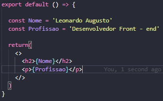
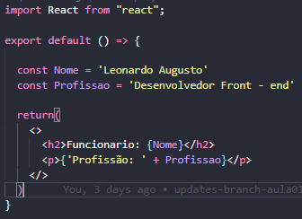
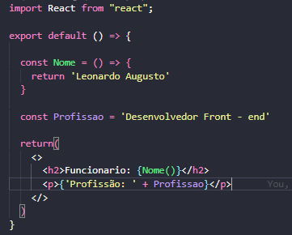
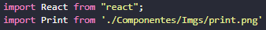
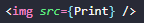

## Expressões em JSX, Inserção de Imagens e Variáveis

### O que é o JSX?

É maneira de criar elementos para serem utilizados como Templates de Aplicações React!,
os elementos criados com JSX são similares com o HTML5 e fornecem aos Desenvolvedores uma forma
mais simples de criar componentes. Por que seja similar ao HTML5, o JSX é interpretado pelo navegador,
por isso é utilizado um 'Transpilador' conhecido como Babel.

#### Expressão

Quando formos usar o JavaScript no HTML5 usamos as chaves `{}`, todas as variáveis e funções são 
adicionadas fora do `return`, também não necessário utilizar a templete string de maneira integral 
dessa maneira `${Nome}`

Podemos usar a concatenação ou adicionar um texto fora da expressão `{}`

É por último podemos retornar textos através de funções

### Inserindo Imagens na nossa Aplicação React
 
Para trabalhar com importação de imagens vamos criar uma pasta dentro de SRC (sendo o nosso conteúdo interno)
com o nome desejado.

Agora dentro de App.js vamos fazer o import da imagem, para importar vamos usar a seguinte sintaxe:
`import Print from'./Componentes/Imgs print.png'` 
e dentro de `` vamos chamar através das `{}` o nome dado para o componente que possui a nossa ``

