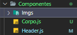
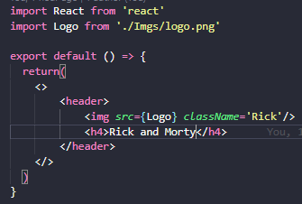
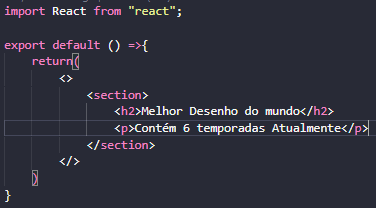

## Criando componentes no React js

Podemos criar componetes de maneira separada (Para melhor organização), para usarmos temos que exporta - los 
no nosso App.jss é interessante criar uma pasta dentro de SRC com os componentes da nossa aplicação

### Componente Header

### Componente Corpo

