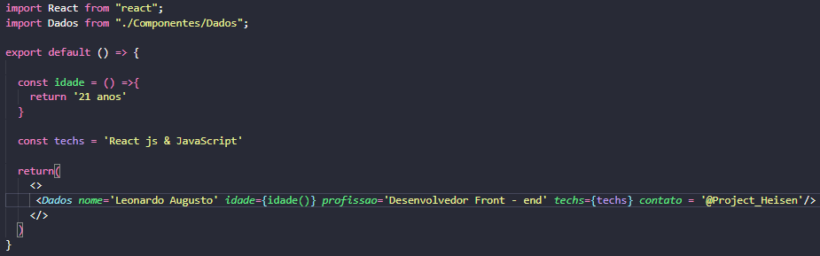
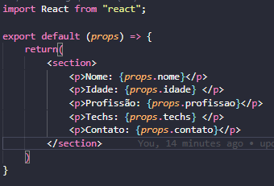
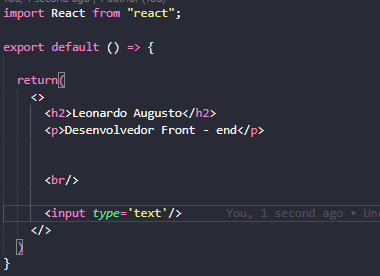

## Entendendo a estrutura de uma Aplicação React

### Node Modules


É uma coleção de funções e objetos do JavaScript que podem ser utilizados por um aplicativo externo
(Modulos que temos importado para utilizar na aplicação)

### Public


Contém arquivos estáticos, como index.html, arquivos da Lib JavaScript, imagens e afins...
Tudo que está em Public é externo, nele temos o index.html responsável por renderizar
nossos componentes!

### SRC


É responsavel por cuidar dos nossos componentes visuais e renderiza - los na pasta public. Dentro
da pasta index.js vamos ter a seguinte estrutura:

```
const root = ReactDOM.createRoot(document.getElementById('root'));
root.render(
  <React.StrictMode>
    <App />
  </React.StrictMode>
);
```
Essa estrutura faz a renderização no index.html dentro de uma DIV com
ID root

### Como funciona o App.js?

Dentro de SRC temos o app.js que é renderizado no index.js ele é nosso componente pai
sua estrutura pode ser feita de duas maneiras mas a mais rápida e prática e usar Arrow functions
para fazer o returno das informações para o index.js que está fazendo a sua chamada!




### Detalhes para tomar cuidar

Só é possivel retornar um componente ou elemento html dentro de App.js por isso normalmente usamos 
<></> que é um tipo de div e dentro delas adicionamos os nossos componentes ou elementos. Além disso o React
não permite tags não finalizadas ex: `<input>`, o metodo correto é `<input/>` com a barra no final!




